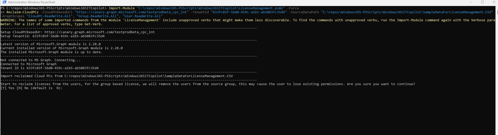
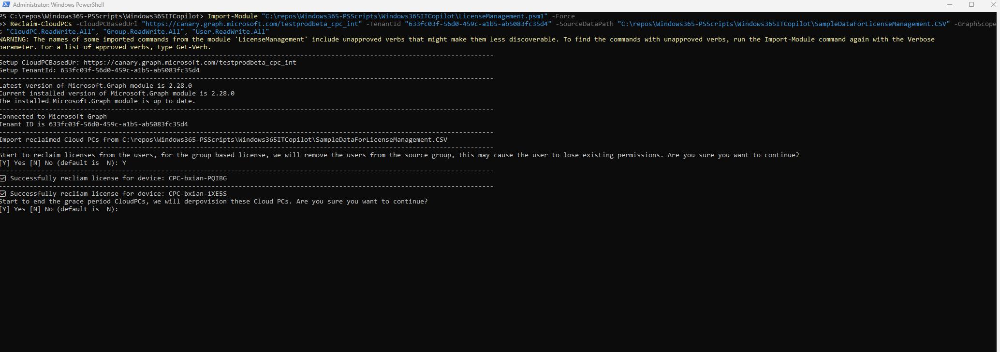
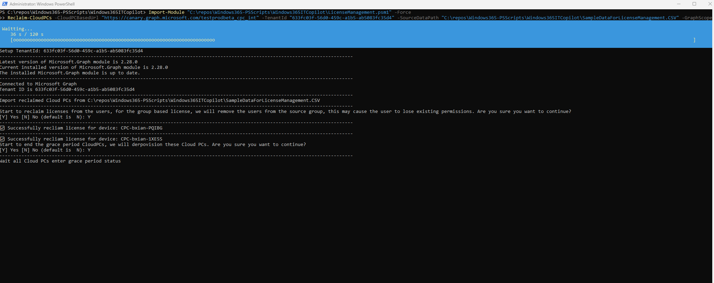

# Windows 365 IT Copilot
The purpose of these PowerShell scripts is to demonstrate the functionality of various cmdlets that assist administrators in manually managing their Cloud PC-related resources. While all the capabilities provided by these scripts are also available through the Microsoft Intune portal, the scripts offer an alternative method for those who prefer or require automation and command-line control.

To use these scripts effectively, administrators need to supply relevant data sources. This information can be conveniently retrieved from the Windows 365 IT Copilot experience within the Intune portal. The IT Copilot provides contextual insights and data that can be used to populate script parameters, making the management process more efficient and tailored to your environment.

These scripts are particularly useful for scenarios such as bulk operations, scheduled tasks, or integration into broader automation workflows, where using the graphical interface might be less practical.

## LicenseManagement.psm1
This PowerShell script is designed to help you manage your Cloud PC licenses more efficiently. It streamlines the processes of resizing by automating the manual steps involved in upgrading, downgrading, and reclaiming licenses, thereby improving operational efficiency and reducing administrative overhead.

### Resize-CloudPCs
This function is used to resize Enterprise Cloud PCs, including those assigned licenses directly as well as those managed through group-based licensing.

#### Parameters

##### CloudPCBasedUrl
The CloudPC graph based url

##### TenantId
The TenantId

##### SourceDataPath
The path of the source data, it should be a csv file

##### GraphScopes
The required graph permissions

#### Required Permission
User.ReadWrite.All, CloudPC.ReadWrite.All, Group.ReadWrite.All

#### Example

PowerShell Command
```powershell
Import-Module "C:\repos\Windows365-PSScripts\Windows365ITCopilot\LicenseManagement.psm1" -Force
Reclaim-CloudPCs -CloudPCBasedUrl "https://canary.graph.microsoft.com/testprodbeta_cpc_int" -TenantId "633fc03f-56d0-459c-a1b5-ab5083fc35d4" -SourceDataPath "C:\repos\Windows365-PSScripts\Windows365ITCopilot\SampleDataForLicenseManagement.CSV" -GraphScopes "CloudPC.ReadWrite.All", "Group.ReadWrite.All", "User.ReadWrite.All"
```

Step1






### Reclaim-CloudPCs
This function is used to reclaim Enterprise Cloud PCs, including those assigned licenses directly as well as those managed through group-based licensing.

#### Parameters

##### CloudPCBasedUrl
The CloudPC graph based url

##### TenantId
The TenantId

##### SourceDataPath
The path of the source data, it should be a csv file

##### GraphScopes
The required graph permissions

#### Required Permission
User.ReadWrite.All, CloudPC.ReadWrite.All, Group.ReadWrite.All

#### Example
PowerShell Command
```powershell
Import-Module "C:\repos\Windows365-PSScripts\Windows365ITCopilot\LicenseManagement.psm1" -Force
Resize-CloudPCs -CloudPCBasedUrl "https://canary.graph.microsoft.com/testprodbeta_cpc_int" -TenantId "633fc03f-56d0-459c-a1b5-ab5083fc35d4" -SourceDataPath "C:\repos\Windows365-PSScripts\Windows365ITCopilot\SampleDataForLicenseManagement.CSV" -GraphScopes "CloudPC.ReadWrite.All", "Group.ReadWrite.All", "User.ReadWrite.All"
```