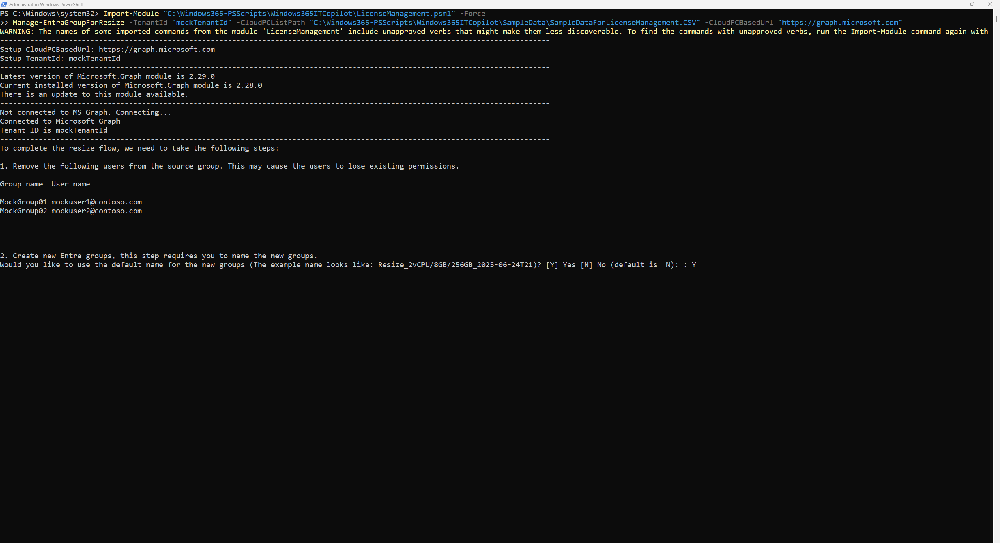
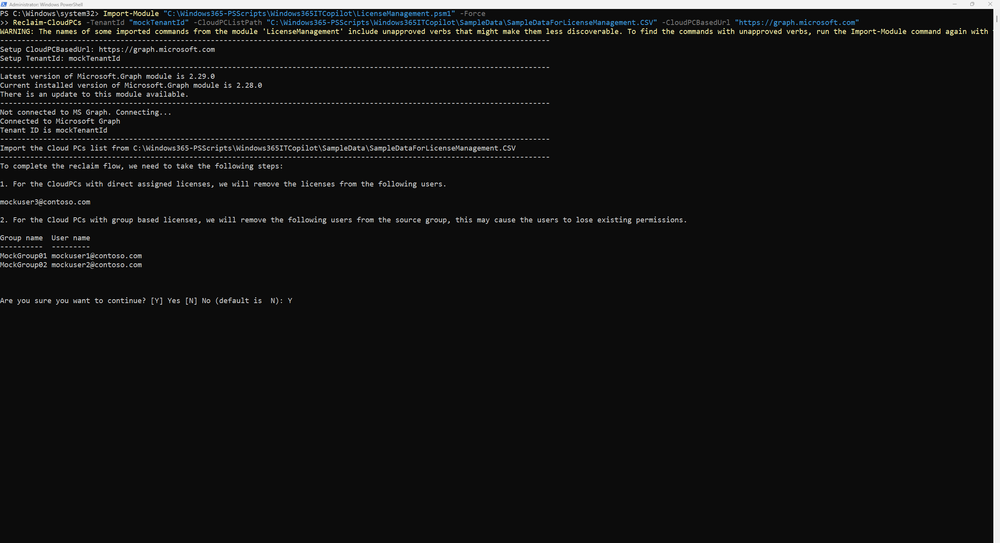

# Windows 365 IT Copilot
The purpose of these PowerShell scripts is to demonstrate the functionality of various cmdlets that assist administrators in manually managing their Cloud PC-related resources. While all the capabilities provided by these scripts are also available through the Microsoft Intune portal, the scripts offer an alternative method for those who prefer or require automation and command-line control.

To use these scripts effectively, administrators need to supply relevant data sources. This information can be conveniently retrieved from the Windows 365 IT Copilot experience within the Intune portal. The IT Copilot provides contextual insights and data that can be used to populate script parameters, making the management process more efficient and tailored to your environment.

These scripts are particularly useful for scenarios such as bulk operations, scheduled tasks, or integration into broader automation workflows, where using the graphical interface might be less practical.

## LicenseManagement.psm1
This PowerShell script is designed to help you manage your Cloud PC licenses more efficiently. It streamlines the processes of resizing by automating the manual steps involved in upgrading, downgrading, and reclaiming licenses, thereby improving operational efficiency and reducing administrative overhead.

### Manage-EntraGroupForResize
This function is used to manage the group for group based licensing Cloud PCs which are in Resize license pending status. 
This function will create the new Entra Group, add the user to the Group, assign the target license and bind the provisioning policy to the Group.

#### Parameters

##### CloudPCBasedUrl
The CloudPC graph based url

##### TenantId
The TenantId

##### CloudPCListPath
The path of a csv file which contains a list of Cloud PCs to be resized

#### Required Permission
CloudPC.ReadWrite.All, Group.ReadWrite.All

#### Example
Below is an example of how to use the `Manage-EntraGroupForResize` function to manage the group for resizing Cloud PCs. 

1. Open the Windows PowerShell console as an **administrator**.

2. Copy the following PowerShell command and paste it into the console.

3. **Replace** {{The directory of your downloaded PowerShell scripts}} with the actual path where you have downloaded the Windows365-PSScripts.

4. **Replace** {{The directory of your downloaded csv files}} with the actual path where you have downloaded the csv file from Intune portal.

5. **Replace** {{The name of your downloaded csv file}} with the actual name of your downloaded csv file.

6. Click **Enter** key to run the PowerShell command.

```powershell
Import-Module "{The directory of your downloaded PowerShell scripts}\Windows365-PSScripts\Windows365ITCopilot\LicenseManagement.psm1" -Force
Manage-EntraGroupForResize -TenantId "{The tenantId}" -CloudPCListPath "{The directory of your downloaded csv files}\{The name of your downloaded csv file}.CSV" -CloudPCBasedUrl "https://graph.microsoft.com"
```

Step 1: Invoke the script to manage the group for resizing


Step 2: Consent to use the default group naming convention or provide a custom group name


Step 3: Read the detail steps that the script will do and consent to proceed


Step 4: Wait for the script to complete the group management


### Reclaim-CloudPCs
This function is used to reclaim the Cloud PCs licenses, includes the direct assigned licenses and group based licenses.

#### Parameters

##### CloudPCBasedUrl
The CloudPC graph based url

##### TenantId
The TenantId

##### CloudPCListPath
The path of a csv file which contains a list of Cloud PCs to be reclaimed

#### Required Permission
Group.ReadWrite.All, User.ReadWrite.All

#### Example
Below is an example of how to use the `Reclaim-CloudPCs` function to reclaim licenses for Cloud PCs. 
1. Open the Windows PowerShell console as an **administrator**.

2. Copy the following PowerShell command and paste it into the console.

3. **Replace** {{The directory of your downloaded PowerShell scripts}} with the actual path where you have downloaded the Windows365-PSScripts.

4. **Replace** {{The directory of your downloaded csv files}} with the actual path where you have downloaded the csv file from Intune portal.

5. **Replace** {{The name of your downloaded csv file}} with the actual name of your downloaded csv file.

6. Click **Enter** key to run the PowerShell command.

```powershell
Import-Module "{The directory of your downloaded PowerShell scripts}\Windows365-PSScripts\Windows365ITCopilot\LicenseManagement.psm1" -Force
Reclaim-CloudPCs -TenantId "{The tenantId}" -CloudPCListPath "{The directory of your downloaded csv files}\{The name of your downloaded csv file}.CSV" -CloudPCBasedUrl "https://graph.microsoft.com"
```

Step 1: Invoke the PowerShell script to reclaim the Cloud PCs licenses


Step 2: Review the detailed steps that the script will perform and consent to proceed


Step 3: Wait for the script to complete the license reclaiming process
